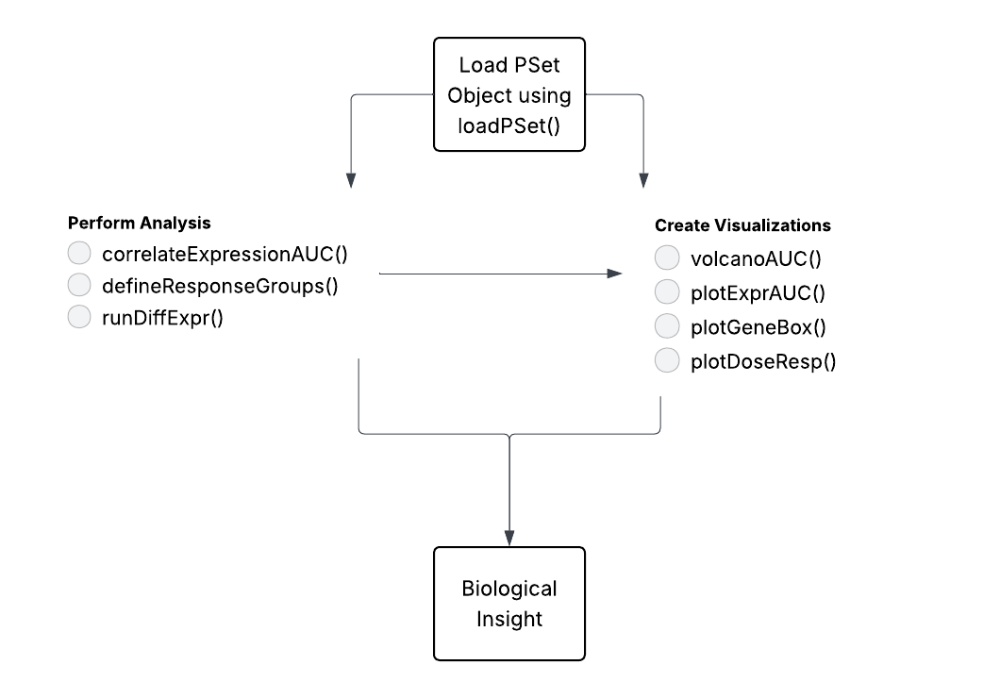

<!-- README.md is generated from README.Rmd. Please edit that file -->

```{r, include = FALSE}
knitr::opts_chunk$set(
  collapse = TRUE,
  comment = "#>",
  fig.path = "man/figures/README-",
  out.width = "100%"
)
```

# PharmacoExploreR

Exploratory Analysis Tools for Pharmacogenomic Data

## Description

PharmacoExploreR Provides reproducible and user-friendly tools for exploratory 
    pharmacogenomic data analysis with PharmacoGx. Simplifies workflows for 
    exploring relationships between drug response data (AUC, IC50) and molecular 
    features such as gene expression from PharmacoSet objects. Includes 
    functions for correlation analysis, sample classification, and high-quality 
    visualizations including volcano plots and dose-response curves.

Current tools like PharmacoGx provide standardized PharmacoSet data structures, 
but require extensive coding knowledge to extract insights and create visualizations. 
PharmacoExploreR improves this workflow by offering easy-to-use functions for 
computing correlations, classifying samples into sensitive/resistant groups, and 
generating publication-quality visualizations such as volcano plots and dose-response 
curves. This makes pharmacogenomic analysis accessible to researchers without 
extensive programming experience.

**R version:** R version 4.3.1 (2023-06-16)  
**Platform:** x86_64-apple-darwin20 (64-bit)  
**Running under:** macOS Ventura 13.5.2

## Installation

**Important:** This package requires Bioconductor packages. Follow these steps in order:

### Step 1: Install Bioconductor Manager
```r
if (!requireNamespace("BiocManager", quietly = TRUE))
    install.packages("BiocManager")
```

### Step 2: Install Bioconductor Dependencies
```r
# This may take several minutes
BiocManager::install(c("PharmacoGx", "SummarizedExperiment"))
```

### Step 3: Install PharmacoExploreR
```r
if (!requireNamespace("devtools", quietly = TRUE))
    install.packages("devtools")

devtools::install_github("vpergola22/PharmacoExploreR", build_vignettes = TRUE)
library("PharmacoExploreR")
```

To run the shinyApp:  
Under construction

## Overview
```{r, eval=FALSE}
ls("package:PharmacoExploreR")
data(package = "PharmacoExploreR")
browseVignettes("PharmacoExploreR")
```

PharmacoExploreR contains 8 main functions:

1. **loadPSet()** - Load or subset a PharmacoSet by drug or tissue type
2. **correlateExpressionAUC()** - Compute correlations between gene expression and drug response
3. **plotExprAUC()** - Generate scatterplots showing expression vs. AUC correlations
4. **volcanoAUC()** - Create volcano plots summarizing correlation strength and significance
5. **defineResponseGroups()** - Classify samples into sensitive or resistant groups
6. **runDiffExpr()** - Perform differential expression between response groups
7. **plotGeneBoxplot()** - Plot expression distribution for genes between groups
8. **plotDoseResponse()** - Plot fitted dose-response curves for cell lines



Refer to package vignettes for detailed tutorials and examples.

## Contributions

The author of this package is Victoria Pergola. The author wrote all functions in this 
package, including correlateExpressionAUC(), volcanoAUC(), plotExprAUC(), 
defineResponseGroups(), runDiffExpr(), plotGeneBoxplot(), plotDoseResponse(), 
and loadPSet().

The following packages were used in development:
- PharmacoGx (Smirnov et al., 2016) for PharmacoSet data structure and accessor functions
- ggplot2 for visualization functions
- SummarizedExperiment for handling expression data
- stats package for correlation testing

[If you used AI tools:]
Generative AI tools were used as follows:
- ChatGPT/Claude was consulted for debugging error messages in correlateExpressionAUC() 
  function. The AI-suggested solutions were reviewed and adapted to fit the package design.

## References

Smirnov, P., Safikhani, Z., El-Hachem, N., Wang, D., She, A., Olsen, C., Freeman, M., 
Selby, H., Gendoo, D. M., Grossman, P., Beck, A. H., Aerts, H. J., Lupien, M., 
Goldenberg, A., & Haibe-Kains, B. (2016). PharmacoGx: an R package for analysis of 
large pharmacogenomic datasets. *Bioinformatics*, 32(8), 1244-1246. 
https://doi.org/10.1093/bioinformatics/btv723

Wickham, H. (2016). ggplot2: Elegant Graphics for Data Analysis. Springer-Verlag New York.


## Acknowledgements

This package was developed as part of an assessment for 2025 BCB410H: Applied 
Bioinformatics course at the University of Toronto, Toronto, CANADA. PharmacoExploreR 
welcomes issues, enhancement requests, and other contributions. To submit an issue, 
use the GitHub issues.


