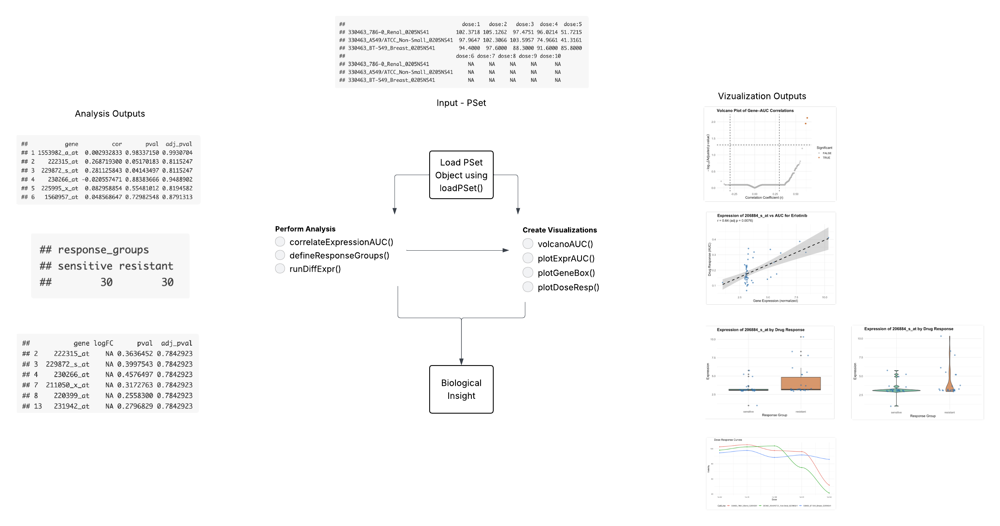

<!-- README.md is generated from README.Rmd. Please edit that file -->

```{r, include = FALSE}
knitr::opts_chunk$set(
  collapse = TRUE,
  comment = "#>",
  fig.path = "man/figures/README-",
  out.width = "100%"
)
```

# PharmacoExploreR

Exploratory Analysis Tools for Pharmacogenomic Data

## Description

PharmacoExploreR Provides reproducible and user-friendly tools for exploratory 
    pharmacogenomic data analysis with PharmacoGx. Simplifies workflows for 
    exploring relationships between drug response data (AUC, IC50) and molecular 
    features such as gene expression from PharmacoSet objects. Includes 
    functions for correlation analysis, sample classification, and high-quality 
    visualizations including volcano plots and dose-response curves.

Current tools like PharmacoGx provide standardized PharmacoSet data structures, 
but require extensive coding knowledge to extract insights and create visualizations. 
PharmacoExploreR improves this workflow by offering easy-to-use functions for 
computing correlations, classifying samples into sensitive/resistant groups, and 
generating publication-quality visualizations such as volcano plots and dose-response 
curves. This makes pharmacogenomic analysis accessible to researchers without 
extensive programming experience.

**R version:** R version 4.3.1 (2023-06-16)  
**Platform:** x86_64-apple-darwin20 (64-bit)  
**Running under:** macOS Ventura 13.5.2

## Installation

**Important:** This package requires Bioconductor packages. Follow these steps in order:

### Step 1: Install Bioconductor Manager
```r
if (!requireNamespace("BiocManager", quietly = TRUE))
    install.packages("BiocManager")
```

### Step 2: Install Bioconductor Dependencies
```r
# This may take several minutes
BiocManager::install(c("PharmacoGx", "SummarizedExperiment"))
```

### Step 3: Install PharmacoExploreR
```r
if (!requireNamespace("devtools", quietly = TRUE))
    install.packages("devtools")

devtools::install_github("vpergola22/PharmacoExploreR", build_vignettes = TRUE)
library("PharmacoExploreR")
```

To run the shinyApp:  
```r
library(PharmacoExploreR)
runPharmacoExploreR()
```

## Overview
```{r, eval=FALSE}
ls("package:PharmacoExploreR")
browseVignettes("PharmacoExploreR")
```

PharmacoExploreR contains 8 main functions:

1. **loadPSet()** - Load or subset a PharmacoSet by drug or tissue type
2. **correlateExpressionAUC()** - Compute correlations between gene expression and drug response
3. **plotExprAUC()** - Generate scatterplots showing expression vs. AUC correlations
4. **volcanoAUC()** - Create volcano plots summarizing correlation strength and significance
5. **defineResponseGroups()** - Classify samples into sensitive or resistant groups
6. **runDiffExpr()** - Perform differential expression between response groups
7. **plotGeneBoxplot()** - Plot expression distribution for genes between groups
8. **plotDoseResponse()** - Plot fitted dose-response curves for cell lines



Refer to package vignettes for detailed tutorials and examples.

## Contributions

The author of this package is Victoria Pergola. The author wrote all functions in this 
package, including correlateExpressionAUC(), volcanoAUC(), plotExprAUC(), 
defineResponseGroups(), runDiffExpr(), plotGeneBoxplot(), plotDoseResponse(), 
and loadPSet().

The following packages were used in development:

- **PharmacoGx** (Smirnov et al., 2016) for PharmacoSet data structure and accessor functions
- **SummarizedExperiment** (Morgan et al., 2024) for handling expression data and molecular profiles
- **ggplot2** (Wickham, 2016) for visualization functions
- **reshape2** (Wickham, 2007) for data transformation
- **shiny** (Chang et al., 2023) for interactive web application
- **DT** (Xie et al., 2025) for interactive data tables
- **stats** for statistical testing and correlation analysis
- **utils** for utility functions
- **limma** (Ritchie et al., 2015) for differential expression analysis (optional)
- **knitr** (Xie, 2025) and **rmarkdown** (Allaire et al., 2025) for documentation
- **testthat** (Wickham, 2011) for unit testing
- **BiocManager** (Morgan & Ramos, 2025) for package management

[If you used AI tools:]
Generative AI tools were used as follows: ChatGPT and Claude were consulted for debugging errors found within the correlateExpressionAUC() function and shiny app. The AI-suggested solutions were reviewed and adapted to fit the package design.

## References
Allaire J, Xie Y, Dervieux C, McPherson J, Luraschi J, Ushey K, Atkins A, Wickham H, Cheng J, Chang W, Iannone R
  (2025). _rmarkdown: Dynamic Documents for R_. R package version 2.30, <https://github.com/rstudio/rmarkdown>.

Chang, W., J. Cheng, J. Allaire, C. Sievert, B. Schloerke, Y. Xie, J. Allen, 
J. McPherson, A. Dipert, B. Borges (2023). shiny: Web Application Framework for 
R. R package version 1.8.0, https://CRAN.R-project.org/package=shiny

Morgan M, Obenchain V, Hester J, Pagès H (2024). _SummarizedExperiment: A container (S4 class) for matrix-like
  assays_. doi:10.18129/B9.bioc.SummarizedExperiment <https://doi.org/10.18129/B9.bioc.SummarizedExperiment>, R package
  version 1.36.0, <https://bioconductor.org/packages/SummarizedExperiment>.
  
Morgan M, Ramos M (2025). _BiocManager: Access the Bioconductor Project Package Repository_. R package version
  1.30.26, <https://CRAN.R-project.org/package=BiocManager>.

R Core Team (2024). _R: A Language and Environment for Statistical Computing_. R Foundation for Statistical Computing,
  Vienna, Austria. <https://www.R-project.org/>.
  
Ritchie, M.E., Phipson, B., Wu, D., Hu, Y., Law, C.W., Shi, W., and Smyth, G.K. (2015). limma powers differential
  expression analyses for RNA-sequencing and microarray studies. Nucleic Acids Research 43(7), e47.

Smirnov, P., Safikhani, Z., El-Hachem, N., Wang, D., She, A., Olsen, C., Freeman, M., 
Selby, H., Gendoo, D. M., Grossman, P., Beck, A. H., Aerts, H. J., Lupien, M., 
Goldenberg, A., & Haibe-Kains, B. (2016). PharmacoGx: an R package for analysis of 
large pharmacogenomic datasets. *Bioinformatics*, 32(8), 1244-1246. 
https://doi.org/10.1093/bioinformatics/btv723

Wickham H (2007). “Reshaping Data with the reshape Package.” _Journal of Statistical Software_, *21*(12), 1-20.
  <https://www.jstatsoft.org/v21/i12/>.
  
Wickham H (2011). “testthat: Get Started with Testing.” _The R Journal_, *3*, 5-10.
  <https://journal.r-project.org/archive/2011-1/RJournal_2011-1_Wickham.pdf>.

Wickham, H. (2016). ggplot2: Elegant Graphics for Data Analysis. Springer-Verlag
New York.

Xie Y (2025). _knitr: A General-Purpose Package for Dynamic Report Generation in R_. R package version 1.50,
  <https://yihui.org/knitr/>.

Xie Y, Cheng J, Tan X, Aden-Buie G (2025). _DT: A Wrapper of the JavaScript Library 'DataTables'_. R package version
  0.34.0, <https://CRAN.R-project.org/package=DT>.


## Acknowledgements

This package was developed as part of an assessment for 2025 BCB410H: Applied 
Bioinformatics course at the University of Toronto, Toronto, CANADA. PharmacoExploreR 
welcomes issues, enhancement requests, and other contributions. To submit an issue, 
use the GitHub issues.


